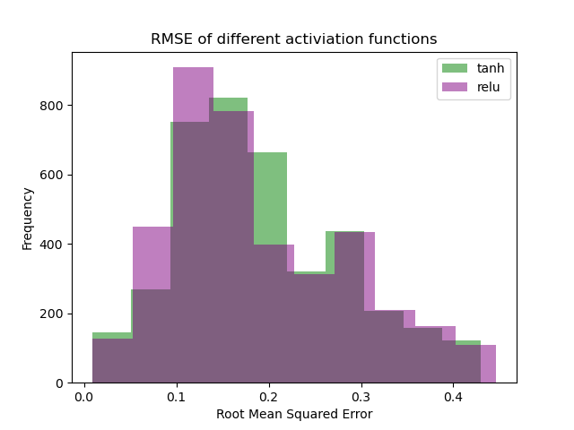
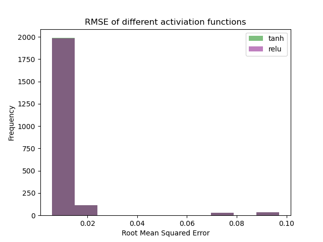

# Homework Solutions

### Question 1

Here are the results for question 1:

**Including stop words**:

best activation function is relu

longest doc: ['possible', 'playoff', 'preview', 'a', 's', 'take', 'a', 'hit', 'in', 'toronto', 'but', 'come', 'home', 'lt', 'b', 'gt', 'lt', 'gt']

Two predicted predicted_words from longest doc are ['lt', 'lt']

Actual: ['manchester', 'hotspur', 'all', 'us', 'cereals', 'to', 'whole', 'grain', 'iraq', 'detainees', 'to', 'play', 'at', 'wrigley', 'field', 'ap', 'hmmm', 'hmmm', 'good', 'lip']

Predicted: ['to', 'with', 'to', 'with', 'with', 'with', 'with', 'with', 'with', 'and', 'with', 'with', 'profit', 'from', 'with', 'with', 'with', 'and', 'with', 'with']

Our ouput has an f1 score of 0, with precision of 0.0 and recall of 0.0

**Not including stop words**:

best activation function is relu

longest doc: ['afp', 'interview', 'un', 'refugee', 'chief', 'says', 'sudan', 'likely', 'grant', 'darfur', 'lt', 'b', 'gt', 'lt', 'gt']

Two predicted predicted_words from longest doc are ['lt', 'lt']

Actual: ['manchester', 'hotspur', 'us', 'cereals', 'whole', 'grain', 'detainees', 'play', 'wrigley', 'field', 'ap', 'hmmm', 'hmmm', 'good', 'lip', 'charles', 'jousts', 'critics', 'game', 'tech']

Predicted: ['us', 'us', 'us', 'us', 'killed', 'killed', 'us', 'us', 'us', 'us', 'us', 'us', 'us', 'us', 'killed', 'killed', 'us', 'us', 'us', 'us']

Our ouput has an f1 score of 0.00019654088050314464, with precision of 0.
00029481132075471697 and recall of 0.00014740566037735848

**Conclusion**:

Because the model trained without stop words has a slightly better f1_score (albiet still very small), without stop words appears to be the more accurate method.

### Question 2

Results
[('the', 0.0463184), ('to', 0.028378924), ('that', 0.021191904), ('of', 0.018853834), ('is', 0.018450983)]
(array([[0.        , 0.52329552, 0.81021318, 0.53815674, 0.74903439,
        0.78332945, 0.8100344 , 0.83229265, 0.53870748, 0.53428371],
       [0.52194984, 0.        , 0.78488861, 0.48508366, 0.59707464,
        0.77211484, 0.80234365, 0.8190714 , 0.47295694, 0.47121437],
       [0.8203222 , 0.80596467, 0.        , 0.8722803 , 0.66365883,
        0.48108382, 0.51227976, 0.53940106, 0.92234427, 0.84469036],
       [0.60434246, 0.49519059, 0.82764652, 0.        , 0.71731698,
        0.80786948, 0.84104169, 0.86024025, 0.51770871, 0.53554639],
       [0.95624764, 0.83275243, 0.79184031, 0.95614742, 0.        ,
        0.78745425, 0.80960599, 0.83857403, 1.        , 0.88040194],
       [0.81478227, 0.83419908, 0.46482514, 0.87124042, 0.66414288,
        0.        , 0.48465702, 0.49710455, 0.86130941, 0.88184154],
       [0.80240792, 0.8380907 , 0.48431176, 0.86129339, 0.66571339,
        0.46244849, 0.        , 0.51144402, 0.89003221, 0.84312271],
       [0.81647959, 0.82222978, 0.49460905, 0.87063647, 0.65889919,
        0.46022974, 0.49662408, 0.        , 0.87810648, 0.88448617],
       [0.5376122 , 0.43977776, 0.81130275, 0.4780832 , 0.69447804,
        0.78453444, 0.81743681, 0.83511034, 0.        , 0.5306749 ],
       [0.53842696, 0.51356818, 0.82270167, 0.55522442, 0.62785338,
        0.81584809, 0.83984896, 0.86738522, 0.57940025, 0.]]), array([[list([['say', 'are', 'or', 'as', 'they', 'about', 'has', 'some', 'just', 'to'], []]),
list([['as', 'has', 'to', 'and', 'more', 'this', 'new', 'in', 'than', 'with'], ['say', 'are', 'they', 'just', 'but', 'it', 'can', 'what', 'out', 'last']]),
list([[], ['say', 'are', 'they', 'has', 'just', 'bn', 'but', 'it', 'can', 'out']]),
list([['have', 'and', 'that', 'as', 'with', 'has', 'from', 'the', 'of', 'by'], ['say', 'are', 'they', 'just', 'prime', 'but', 'it', 'can', 'out', 'were']]),
list([['and', 'as', 'new', 'for', 'in'], ['say', 'are', 'stocks', 'they', 'has', 'just', 'www', 'but', 'it', 'can']]),
list([[], ['say', 'drivers', 'are', 'boom', 'mo', 'they', 'has', 'just', 'but', 'yards']]),
list([[], ['say', 'are', 'english', 'they', 'has', 'store', 'just', 'mining', 'but', 'it']]),
list([[], ['say', 'are', 'offered', 'they', 'has', 'just', 'but', 'demonstration', 'darfur', 'it']]),
list([['as', 'has', 'to', 'will', 'and', 'this', 'new', 'in', 'is', 'with'], ['say', 'are', 'they', 'just', 'season', 'saturday', 'but', 'game', 'it', 'can']]),
list([['have', 'and', 'it', 'that', 'as', 'with', 'has', 'from', 'the', 'of'], ['say', 'based', 'are', 'they', 'just', 'but', 'internet', 'can', 'out', 'most']])],
[list([['as', 'has', 'to', 'and', 'more', 'this', 'new', 'in', 'than', 'with'], ['say', 'record', 'are', 'or', 'over', 'against', 'quarter', 'they', 'about', 'some']]),
list([['record', 'over', 'against', 'quarter', 'as', 'has', 'to', 'on', 'reuters', 'was'], []]),
list([[], ['has', 'bn', 'australia', 'broad', 'last', 'stern', 'oil', 'commissioner', 'motors', 'reform']]),
list([['as', 'has', 'to', 'on', 'reuters', 'was', 'and', 'in', 'its', 'government'], ['record', 'country', 'over', 'against', 'quarter', 'election', 'afp', 'his', 'prime', 'court']]),
list([['and', 'wednesday', 'quarter', 'as', 'thursday', 'after', 'new', 'tuesday', 'friday', 'for'], ['stocks', 'has', 'www', 'last', 'href', 'http', 'oil', 'stores', 'gt', 'expected']]),
list([[], ['drivers', 'boom', 'mo', 'has', 'yards', 'love', 'catch', 'wish', 'last', 'grand']]),
list([[], ['english', 'has', 'store', 'mining', 'calls', 'last', 'mainstream', 'oil', 'tony', 'expected']]),
list([[], ['offered', 'has', 'demonstration', 'darfur', 'practice', 'last', 'grand', 'nortel', 'need', 'oil']]),
list([['over', 'against', 'as', 'has', 'to', 'on', 'was', 'and', 'second', 'last'], ['record', 'quarter', 'league', 'his', 'season', 'saturday', 'reuters', 'game', 'will', 'three']]),
list([['over', 'as', 'has', 'to', 'on', 'and', 'new', 'in', 'its', 'with'], ['billion', 'which', 'record', 'based', 'against', 'quarter', 'technology', 'search', 'announced', 'reuters']])],
[list([[], ['say', 'are', 'they', 'has', 'just', 'bn', 'but', 'it', 'can', 'out']]),
list([[], ['has', 'bn', 'australia', 'broad', 'last', 'stern', 'oil', 'commissioner', 'motors', 'reform']]),
list([['invest', 'nike', 'cola', 'sydney', 'research', 'bn', 'operator', 'ag', 'profile', 'australia'], []]),
list([[], ['has', 'bn', 'prime', 'australia', 'broad', 'were', 'stern', 'is', 'commissioner', 'motors']]),
list([[], ['stocks', 'bn', 'www', 'australia', 'broad', 'href', 'stern', 'http', 'stores', 'commissioner']]),
list([['gold'], ['drivers', 'boom', 'mo', 'bn', 'yards', 'love', 'catch', 'wish', 'australia', 'broad']]),
list([['chain'], ['english', 'store', 'bn', 'mining', 'calls', 'australia', 'broad', 'mainstream', 'stern', 'tony']]),
list([[], ['offered', 'bn', 'demonstration', 'darfur', 'practice', 'australia', 'broad', 'grand', 'stern', 'nortel']]),
list([[], ['has', 'bn', 'season', 'saturday', 'game', 'australia', 'broad', 'last', 'stern', 'is']]),
list([[], ['based', 'has', 'bn', 'it', 'internet', 'australia', 'broad', 'stern', 'is', 'commissioner']])],
[list([['have', 'and', 'that', 'as', 'with', 'has', 'from', 'the', 'of', 'by'], ['say', 'are', 'they', 'just', 'prime', 'but', 'it', 'can', 'out', 'were']]),
list([['as', 'has', 'to', 'on', 'reuters', 'was', 'and', 'in', 'its', 'government'], ['record', 'country', 'over', 'against', 'quarter', 'election', 'afp', 'his', 'prime', 'court']]),
list([[], ['has', 'bn', 'prime', 'australia', 'broad', 'were', 'stern', 'is', 'commissioner', 'motors']]),
list([['country', 'as', 'election', 'has', 'afp', 'to', 'prime', 'his', 'on', 'reuters'], []]),
list([['and', 'wednesday', 'as', 'monday', 'thursday', 'after', 'tuesday', 'for', 'reuters', 'in'], ['stocks', 'has', 'www', 'prime', 'href', 'were', 'http', 'stores', 'is', 'gt']]),
list([[], ['drivers', 'boom', 'mo', 'has', 'prime', 'yards', 'love', 'catch', 'wish', 'were']]),
list([[], ['english', 'has', 'store', 'mining', 'prime', 'calls', 'were', 'mainstream', 'is', 'tony']]),
list([[], ['offered', 'has', 'prime', 'demonstration', 'darfur', 'practice', 'were', 'grand', 'nortel', 'need']]),
list([['as', 'has', 'to', 'his', 'on', 'was', 'and', 'he', 'in', 'is'], ['country', 'over', 'against', 'league', 'election', 'afp', 'prime', 'season', 'saturday', 'reuters']]),
list([['as', 'has', 'to', 'on', 'and', 'in', 'is', 'its', 'with', 'an'], ['billion', 'which', 'based', 'over', 'country', 'election', 'technology', 'search', 'afp', 'his']])],
[list([['and', 'as', 'new', 'for', 'in'], ['say', 'are', 'stocks', 'they', 'has', 'just', 'www', 'but', 'it', 'can']]),
list([['and', 'wednesday', 'quarter', 'as', 'thursday', 'after', 'new', 'tuesday', 'for', 'friday'], ['stocks', 'has', 'www', 'last', 'href', 'oil', 'http', 'stores', 'gt', 'expected']]),
list([[], ['stocks', 'bn', 'www', 'australia', 'broad', 'href', 'stern', 'http', 'stores', 'commissioner']]),
list([['and', 'wednesday', 'as', 'monday', 'thursday', 'after', 'tuesday', 'for', 'on', 'reuters'], ['stocks', 'has', 'www', 'prime', 'href', 'were', 'http', 'is', 'stores', 'gt']]),
list([['fullquote', 'stocks', 'quarter', 'as', 'profit', 'co', 'www', 'com', 'largest', 'retailer'], []]),
list([[], ['drivers', 'stocks', 'boom', 'mo', 'www', 'yards', 'love', 'catch', 'wish', 'href']]),
list([[], ['stocks', 'english', 'store', 'www', 'mining', 'calls', 'href', 'mainstream', 'http', 'stores']]),
list([[], ['stocks', 'offered', 'www', 'demonstration', 'darfur', 'practice', 'href', 'grand', 'nortel', 'need']]),
list([['and', 'as', 'for', 'new', 'on', 'after', 'in'], ['stocks', 'has', 'www', 'season', 'saturday', 'game', 'last', 'href', 'http', 'is']]),
list([['and', 'as', 'corp', 'inc', 'for', 'new', 'on', 'in', 'said', 'its'], ['based', 'stocks', 'has', 'www', 'it', 'internet', 'href', 'http', 'is', 'stores']])],
[list([[], ['say', 'drivers', 'are', 'boom', 'mo', 'they', 'has', 'just', 'but', 'yards']]),
list([[], ['drivers', 'boom', 'mo', 'has', 'yards', 'love', 'catch', 'wish', 'last', 'grand']]),
list([['gold'], ['drivers', 'boom', 'mo', 'bn', 'yards', 'love', 'catch', 'wish', 'australia', 'broad']]),
list([[], ['drivers', 'boom', 'mo', 'has', 'prime', 'yards', 'love', 'catch', 'wish', 'were']]),
list([[], ['drivers', 'stocks', 'boom', 'mo', 'www', 'yards', 'love', 'catch', 'wish', 'href']]),
list([['seventh', 'drivers', 'paul', 'olympics', 'chiefs', 'michael', 'boom', 'mo', 'professional', 'kansas'], []]),
list([['playing'], ['drivers', 'english', 'boom', 'mo', 'store', 'mining', 'yards', 'love', 'catch', 'wish']]),
list([['grand'], ['drivers', 'boom', 'offered', 'mo', 'yards', 'love', 'catch', 'demonstration', 'darfur', 'wish']]),
list([[], ['drivers', 'boom', 'mo', 'has', 'season', 'saturday', 'yards', 'game', 'love', 'catch']]),
list([[], ['drivers', 'based', 'boom', 'mo', 'has', 'yards', 'love', 'catch', 'wish', 'it']])],
[list([[], ['say', 'are', 'english', 'they', 'has', 'store', 'just', 'mining', 'but', 'it']]),
list([[], ['english', 'has', 'store', 'mining', 'calls', 'last', 'mainstream', 'oil', 'tony', 'expected']]),
list([['chain'], ['english', 'store', 'bn', 'mining', 'australia', 'broad', 'calls', 'stern', 'mainstream', 'tony']]),
list([[], ['english', 'has', 'store', 'prime', 'mining', 'calls', 'were', 'mainstream', 'is', 'tony']]),
list([[], ['stocks', 'english', 'store', 'www', 'mining', 'calls', 'href', 'mainstream', 'http', 'stores']]),
list([['playing'], ['drivers', 'boom', 'mo', 'english', 'store', 'mining', 'yards', 'love', 'catch', 'wish']]),
list([['features', 'allows', 'policies', 'english', 'trend', 'store', 'licensing', 'yahoo', 'chavez', 'mining'], []]),
list([[], ['english', 'offered', 'store', 'mining', 'demonstration', 'darfur', 'practice', 'calls', 'grand', 'mainstream']]),
list([[], ['english', 'has', 'store', 'season', 'saturday', 'mining', 'game', 'calls', 'last', 'mainstream']]),
list([[], ['based', 'english', 'has', 'store', 'mining', 'it', 'internet', 'calls', 'mainstream', 'is']])],
[list([[], ['say', 'are', 'offered', 'they', 'has', 'just', 'but', 'demonstration', 'darfur', 'it']]),
list([[], ['offered', 'has', 'demonstration', 'darfur', 'practice', 'last', 'grand', 'nortel', 'need', 'oil']]),
list([[], ['offered', 'bn', 'demonstration', 'darfur', 'practice', 'australia', 'broad', 'grand', 'stern', 'nortel']]),
list([[], ['offered', 'has', 'prime', 'demonstration', 'darfur', 'practice', 'were', 'grand', 'nortel', 'need']]),
list([[], ['stocks', 'offered', 'www', 'demonstration', 'darfur', 'practice', 'href', 'grand', 'nortel', 'need']]),
list([['grand'], ['drivers', 'boom', 'mo', 'offered', 'yards', 'resume', 'love', 'catch', 'demonstration', 'wish']]),
list([[], ['english', 'offered', 'store', 'mining', 'resume', 'demonstration', 'darfur', 'practice', 'calls', 'grand']]),
list([['va', 'msn', 'defended', 'theft', 'offered', 'pacific', 'audio', 'sudan', 'heating', 'vegas'], []]),
list([[], ['offered', 'has', 'season', 'saturday', 'game', 'demonstration', 'darfur', 'practice', 'last', 'grand']]),
list([[], ['based', 'offered', 'has', 'demonstration', 'darfur', 'it', 'internet', 'practice', 'grand', 'nortel']])],
[list([['as', 'has', 'to', 'will', 'and', 'this', 'new', 'in', 'is', 'with'], ['say', 'are', 'they', 'just', 'his', 'season', 'but', 'saturday', 'game', 'it']]),
list([['over', 'against', 'as', 'has', 'to', 'on', 'was', 'and', 'second', 'this'], ['record', 'quarter', 'league', 'his', 'season', 'saturday', 'reuters', 'game', 'will', 'three']]),
list([[], ['has', 'bn', 'season', 'saturday', 'game', 'australia', 'broad', 'last', 'stern', 'is']]),
list([['as', 'has', 'to', 'his', 'on', 'was', 'and', 'he', 'in', 'is'], ['country', 'over', 'against', 'league', 'election', 'afp', 'season', 'prime', 'saturday', 'reuters']]),
list([['and', 'as', 'new', 'for', 'after', 'in', 'on'], ['stocks', 'has', 'www', 'season', 'saturday', 'game', 'last', 'href', 'http', 'stores']]),
list([[], ['drivers', 'boom', 'mo', 'has', 'season', 'saturday', 'yards', 'game', 'love', 'catch']]),
list([[], ['english', 'has', 'store', 'mining', 'season', 'saturday', 'game', 'calls', 'last', 'mainstream']]),
list([[], ['offered', 'has', 'season', 'saturday', 'game', 'demonstration', 'darfur', 'practice', 'last', 'grand']]),
list([['over', 'against', 'as', 'league', 'has', 'to', 'season', 'his', 'saturday', 'on'], []]),
list([['over', 'as', 'has', 'to', 'on', 'will', 'and', 'new', 'in', 'is'], ['billion', 'which', 'based', 'his', 'season', 'saturday', 'game', 'it', 'internet', 'last']])],
[list([['have', 'it', 'and', 'that', 'as', 'with', 'has', 'from', 'the', 'of'], ['say', 'based', 'are', 'they', 'just', 'but', 'internet', 'can', 'out', 'most']]),
list([['over', 'as', 'has', 'to', 'on', 'and', 'new', 'in', 'its', 'with'], ['billion', 'which', 'record', 'based', 'against', 'quarter', 'technology', 'search', 'announced', 'reuters']]),
list([[], ['based', 'has', 'bn', 'it', 'internet', 'australia', 'broad', 'stern', 'is', 'commissioner']]),
list([['as', 'has', 'to', 'on', 'and', 'in', 'is', 'its', 'with', 'an'], ['billion', 'which', 'country', 'based', 'over', 'technology', 'election', 'afp', 'search', 'his']]),
list([['and', 'as', 'corp', 'inc', 'new', 'for', 'in', 'said', 'its', 'on'], ['based', 'stocks', 'has', 'www', 'it', 'internet', 'href', 'http', 'stores', 'is']]),
list([[], ['drivers', 'based', 'boom', 'mo', 'has', 'yards', 'love', 'catch', 'wish', 'it']]),
list([[], ['based', 'english', 'has', 'store', 'mining', 'it', 'internet', 'calls', 'mainstream', 'is']]),
list([[], ['based', 'offered', 'has', 'demonstration', 'darfur', 'it', 'practice', 'internet', 'grand', 'nortel']]),
list([['over', 'as', 'has', 'to', 'on', 'will', 'and', 'new', 'in', 'is'], ['billion', 'which', 'based', 'against', 'league', 'technology', 'search', 'his', 'season', 'saturday']]),
list([['billion', 'which', 'based', 'over', 'as', 'has', 'technology', 'search', 'for', 'to'], []])]]
